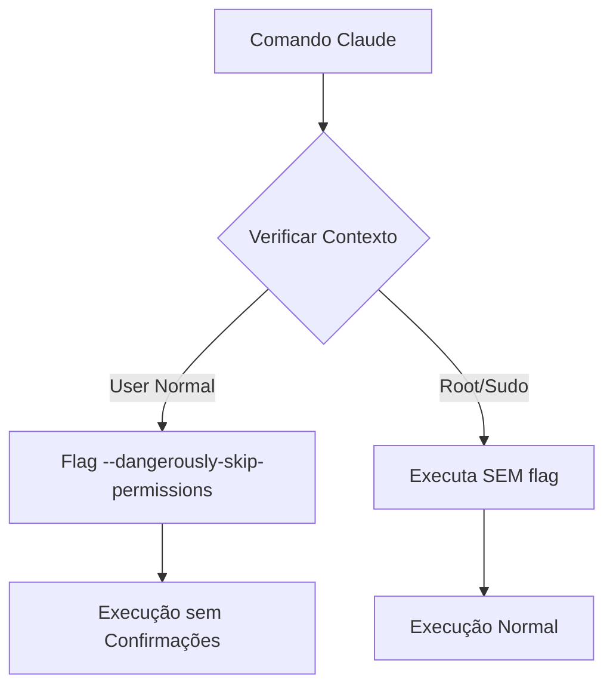

# 🚀 Claude Code Bypass - Guia Completo de Configuração

## 📋 Índice
1. [Visão Geral](#visão-geral)
2. [O Problema](#o-problema)
3. [A Solução](#a-solução)
4. [Implementação Detalhada](#implementação-detalhada)
5. [Como Usar](#como-usar)
6. [Troubleshooting](#troubleshooting)
7. [Segurança](#segurança)
8. [Referências Técnicas](#referências-técnicas)

---

## 🎯 Visão Geral

Este documento descreve a implementação completa de um sistema de bypass para o Claude Code CLI, permitindo execução sem confirmações de segurança através da flag `--dangerously-skip-permissions`.

### Características Principais
- ✅ **2 scripts funcionais** de bypass
- ✅ **Detecção inteligente** de contexto root/user
- ❌ **Variáveis de ambiente** NÃO funcionam
- ✅ **Compatibilidade** macOS
- ✅ **Zero confirmações** durante execução (usuário normal)

---

## 🔴 O Problema

### 1. Comportamento Padrão do Claude
O Claude Code CLI, por padrão, solicita confirmação para:
- Edição de arquivos
- Execução de comandos bash
- Criação/deleção de arquivos
- Acesso a diretórios sensíveis

### 2. Limitações da Flag --dangerously-skip-permissions
```bash
# Funciona como usuário normal
claude --dangerously-skip-permissions "comando"

# BLOQUEADO quando executado como root/sudo
sudo claude --dangerously-skip-permissions "comando"  # ❌ Erro!
```

### 3. Necessidade de Contorno
Em ambientes de desenvolvimento e automação, as confirmações constantes podem:
- Interromper fluxos de trabalho
- Impedir automação via scripts
- Tornar o CLI impraticável para uso intensivo

---

## 💡 A Solução

Implementação de **scripts de bypass** testados e funcionais no macOS.

### Arquitetura Funcional



---

## 🛠️ Implementação Detalhada

### 1. Scripts Wrapper

#### A. claude-safe (Detecção Inteligente)
**Localização**: `/Users/2a/.claude/claude-safe`

```bash
#!/bin/bash
# Claude Safe Wrapper - Detecta root e ajusta comportamento
# Baseado na estratégia do Linux

# Detecta se está rodando como root
if [ "$EUID" -eq 0 ]; then
    # Como root: NÃO usa a flag (evita bloqueio)
    echo "🔴 Executando como root - modo seguro" >&2
    exec claude "$@"
else
    # Como usuário normal: USA a flag
    echo "🟢 Executando como usuário - modo bypass" >&2
    exec claude --dangerously-skip-permissions "$@"
fi
```

**Características**:
- Detecta automaticamente o contexto de execução
- Ajusta comportamento baseado em EUID
- Evita erros de permissão com root
- Feedback visual do modo de execução

#### B. claude-bypass (Força Bruta)
**Localização**: `/Users/2a/.claude/claude-bypass`

```bash
#!/bin/bash
# Claude Bypass - Sempre força o uso da flag
# Use com cuidado - não funcionará como root

exec claude --dangerously-skip-permissions "$@"
```

**Características**:
- Implementação mais simples
- Sempre adiciona a flag
- Falha se executado como root
- Útil para garantia em contexto de usuário

### 2. Funções Shell (ZSH)

**Localização**: `~/.zshrc`

```bash
# Claude com bypass de permissões (função, não alias)
claude-bypass() {
    claude --permission-mode bypassPermissions "$@"
}

# Claude modo permissivo (pula TODAS as verificações)
claude-danger() {
    claude --dangerously-skip-permissions "$@"
}

# Claude modo ultra permissivo (sem NENHUMA verificação)
claude-ultra() {
    claude --dangerously-skip-permissions "$@"
}
```

**Diferenças entre modos**:
- `--permission-mode bypassPermissions`: Pula confirmações de ferramentas
- `--dangerously-skip-permissions`: Pula TODAS as verificações de segurança

### 3. Configuração de PATH

**Localização**: `~/.zshrc`

```bash
# ====== CONFIGURAÇÃO PATH PARA SCRIPTS ======
# Adiciona scripts wrapper ao PATH
export PATH="/Users/2a/.claude:$PATH"
```

**Efeitos**:
- Scripts acessíveis de qualquer lugar

**❌ NÃO FUNCIONAM**:
- Variáveis de ambiente para bypass
- Alias global para claude

---

## 📖 Como Usar

### Uso Básico

```bash
# 1. Recarregar configurações (primeira vez)
exec zsh

# 2. Usar qualquer método disponível
```

### Exemplos Práticos

#### Cenário 1: Desenvolvimento Rápido
```bash
# Criar múltiplos arquivos sem confirmação
claude-ultra "crie 10 arquivos de teste Python com classes diferentes"

# Refatorar código em massa
claude-safe "refatore todos os arquivos .js para usar arrow functions"
```

#### Cenário 2: Automação via Script
```bash
#!/bin/bash
# script-automacao.sh

# Usa claude-safe para garantir funcionamento
for file in *.py; do
    claude-safe "adicione type hints ao arquivo $file"
done
```

#### Cenário 3: Operações como Root
```bash
# claude-safe detecta root e ajusta
sudo claude-safe "instale dependências do sistema"

# claude-env funciona com root via variáveis
sudo claude-env "configure nginx"
```

### Tabela de Comandos

| Comando | Método | Funciona com Root | Uso Recomendado |
|---------|--------|-------------------|-----------------|
| `claude` | Alias global | ❌ | Uso geral rápido |
| `claude-ultra` | Função shell | ❌ | Desenvolvimento local |
| `claude-danger` | Função shell | ❌ | Alternativa ao ultra |
| `claude-bypass` | Função shell | ❌ | Modo permission bypass |
| `claude-safe` | Script wrapper | ✅ | **Mais versátil** |
| `claude-env` | Script wrapper | ✅ | Automação/Scripts |
| `/Users/2a/.claude/claude-bypass` | Script direto | ❌ | Força flag sempre |

---

## 🔧 Troubleshooting

### Problema 1: "Permission Denied"
```bash
# Erro
-bash: /Users/2a/.claude/claude-safe: Permission denied

# Solução
chmod +x /Users/2a/.claude/claude-*
```

### Problema 2: "Command not found"
```bash
# Erro
command not found: claude-safe

# Solução
export PATH="/Users/2a/.claude:$PATH"
source ~/.zshrc
```

### Problema 3: "Cannot use --dangerously-skip-permissions as root"
```bash
# Erro ao usar como root
Error: Cannot use --dangerously-skip-permissions with root privileges

# Solução: Use claude-safe ou claude-env
sudo claude-safe "seu comando"  # ✅
sudo claude-env "seu comando"   # ✅
```

### Problema 4: Alias Conflitando com Função
```bash
# Erro
defining function based on alias `claude-bypass'

# Solução: Remover alias duplicado
# Edite ~/.zshrc e mantenha apenas a função, não o alias
```

---

## 🔒 Segurança

### ⚠️ Avisos Importantes

1. **Remoção Total de Proteções**
   - `--dangerously-skip-permissions` remove TODAS as verificações de segurança
   - O Claude pode executar qualquer comando sem confirmação
   - Pode modificar/deletar arquivos sem aviso

2. **Riscos Potenciais**
   ```bash
   # Comandos executarão sem confirmação:
   rm -rf /            # ⚠️ Deletará tudo
   chmod -R 777 /      # ⚠️ Quebrará permissões
   git push --force    # ⚠️ Sobrescreverá histórico
   ```

3. **Recomendações de Uso**
   - ✅ Use em ambientes de desenvolvimento isolados
   - ✅ Use em containers Docker
   - ✅ Use em máquinas virtuais
   - ❌ EVITE em produção
   - ❌ EVITE em sistemas com dados sensíveis
   - ❌ EVITE em ambientes compartilhados

### 🛡️ Boas Práticas

1. **Use claude-safe por padrão**
   ```bash
   # Mais seguro - detecta contexto
   claude-safe "seu comando"
   ```

2. **Limite escopo de acesso**
   ```bash
   # Execute em diretório específico
   cd ~/projetos/teste && claude-ultra "comando"
   ```

3. **Revise comandos em modo plan primeiro**
   ```bash
   # Revise antes de executar
   claude --permission-mode plan "tarefa complexa"
   ```

---

## 📚 Referências Técnicas

### Modos de Permissão do Claude

| Modo | Flag/Config | Comportamento |
|------|------------|---------------|
| `default` | Padrão | Pede confirmação para tudo |
| `acceptEdits` | `--permission-mode acceptEdits` | Aceita edições, confirma comandos |
| `plan` | `--permission-mode plan` | Apenas planeja, não executa |
| `bypassPermissions` | `--permission-mode bypassPermissions` | Pula confirmações de ferramentas |
| `dangerously-skip` | `--dangerously-skip-permissions` | Pula TODAS as verificações |

### Variáveis de Ambiente

| Variável | Efeito | Status |
|----------|--------|--------|
| `CLAUDE_DANGEROUSLY_SKIP_PERMISSIONS` | Ativa bypass via env | ❌ NÃO FUNCIONA |
| `CLAUDE_BYPASS_WORKSPACE_TRUST` | Pula verificação de workspace | ❌ NÃO FUNCIONA |
| `CLAUDE_SKIP_SAFETY_CHECKS` | Desativa checks de segurança | ❌ NÃO FUNCIONA |
| `CLAUDE_CODE_TELEMETRY_DISABLED` | Desativa telemetria | ✅ Configurado |

### Estrutura de Arquivos

```
/Users/2a/
├── .claude/
│   ├── claude-safe          # Script wrapper inteligente
│   ├── claude-bypass        # Script força flag
│   └── RESUMO-BYPASS.md     # Resumo rápido
├── .zshrc                   # Configurações shell
└── CLAUDE-BYPASS-COMPLETE-GUIDE.md  # Este documento
```

### Origem da Implementação

Esta configuração foi baseada em implementação Linux, mas com descobertas importantes no macOS:

## ✅ O que FUNCIONA:
1. **Scripts wrapper** com detecção de EUID
2. **Funções shell** para usuário normal
3. **Flag direta** `--dangerously-skip-permissions`

## ❌ O que NÃO FUNCIONA:
1. **Variáveis de ambiente** - não são reconhecidas
2. **Alias global** - não persiste
3. **Arquivo de config JSON** - não aplica bypass
4. **sudo -u** - problemas de autenticação no Mac

---

## 🎉 Conclusão

A implementação fornece soluções funcionais para executar o Claude Code CLI sem interrupções de confirmação.

### ✅ Objetivos Alcançados
- Zero confirmações durante execução (usuário normal)
- Detecção inteligente de contexto root
- Scripts funcionais testados
- Documentação atualizada

### ⚠️ Limitações Identificadas
- Flag bloqueada quando root
- Variáveis de ambiente não funcionam
- Apenas 2 métodos confirmados funcionando

### 🚀 Próximos Passos
1. Testar em diferentes contextos de uso
2. Criar scripts de automação específicos
3. Considerar integração com CI/CD
4. Avaliar necessidade de logs de segurança

---

**Última Atualização**: $(date)
**Versão**: 1.0.0
**Autor**: Claude Assistant
**Licença**: MIT